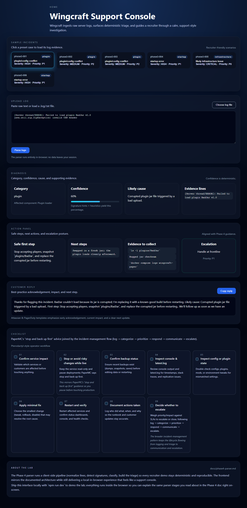
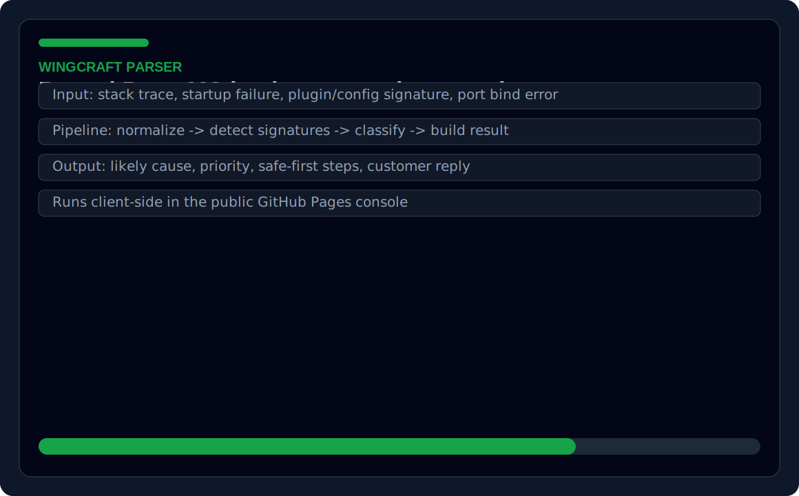
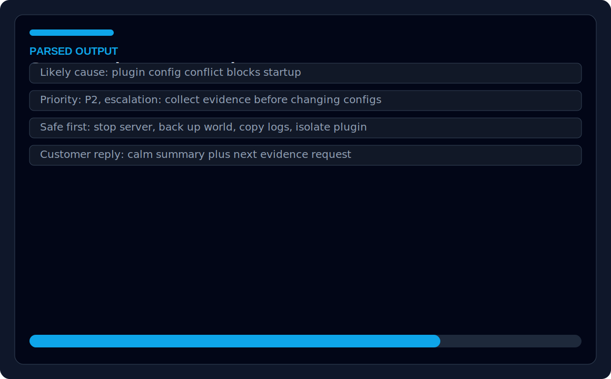

# Wingcraft Triage Lab

Wingcraft is an incident-triage support console and parser lab for diagnosing reproduced PaperMC server issues. It combines a React/TypeScript frontend, modular parser packages, seeded incident records, Docker Compose scenarios, safe-first runbooks, and GitHub Pages deployment. This project demonstrates frontend development, parser architecture, rule-based classification, deterministic test data, support tooling, technical documentation, and reproducible incident workflows.

## Quick links
- **Live demo:** [Wingcraft parser console](https://josuejero.github.io/wingcraft/)
- **Screenshots:** [public parser console](frontend/public/assets/screenshots/parser-console.png), [parser result proof](frontend/public/assets/screenshots/parser-result.svg), [sample output](frontend/public/assets/screenshots/sample-output.svg)
- **Test report:** `npm run test`
- **CI workflow:** `.github/workflows/pages.yml`
- **Architecture docs:** `docs/phase4-parser.md`, `docs/phase3-incidents.md`, `docs/lab-guidance.md`, `docs/walkthrough.md`
- **Main code to inspect:** `frontend/src/App.tsx`, `packages/parser/`, `packages/data/incidents.json`, `ops-lab/`

## Employer scan
**Best fit roles:** Frontend Developer, Technical Support Engineer, Developer Tools Engineer, QA Automation Engineer  
**Core stack:** React, TypeScript, Vite, parser packages, Docker Compose, GitHub Pages  
**What this proves:** Support-console UX, parser architecture, rule-based triage, deterministic fixtures, runbooks, reproducible incident workflows  
**Start here:** `frontend/src/`, `packages/parser/`, `packages/data/`, `docs/phase4-parser.md`

## Screenshot gallery
| Public parser console | Triage result |
| --- | --- |
|  |  |



## Sample parser behavior
Sample log input:

```text
[12:04:11 ERROR]: Could not load 'plugins/ChunkGuard.jar' in folder 'plugins'
org.bukkit.configuration.InvalidConfigurationException: while parsing config.yml
Caused by: mapping values are not allowed here in 'plugins/ChunkGuard/config.yml'
```

Sample parsed output:

```json
{
  "likelyCause": "Plugin configuration conflict prevents PaperMC startup.",
  "priority": "P2",
  "safeFirstStep": "Stop the server, back up the world, preserve logs, then isolate the plugin config.",
  "customerMessage": "We found a startup failure tied to a plugin configuration file and are preserving evidence before changing server files."
}
```

The Docker Compose ops lab is available for reproducing incidents locally, but the public product starts with the browser-based parser console so reviewers can inspect behavior immediately.

## Repository layout
- `package.json` / workspace scripts – bootstrap, build/test/lint orchestration, and shared devDependencies.
- `packages/` – monorepo packages that build the parser pipeline, seeded data, and shared types. See the module list under **Parser architecture** below for how they connect.
- `frontend/` – React + Vite demo that plugs straight into `@wingcraft/parser`, shows sample incidents, and exports `frontend/dist` for GitHub Pages deployment.
- `ops-lab/` – Docker Compose lab, reusable configs, scenario manifests, and scripts for safe-first steps, fault injection, and reset helpers.
- `docs/` – written guidance, catalogs, and walkthroughs grounding every workflow in the new recruit training narrative.
- `.github/workflows/pages.yml` – builds `frontend/dist` and pushes it to `gh-pages`.

## Parser architecture
The parser is hand-crafted TypeScript with modular packages that can be swapped or reused independently:

- `@wingcraft/types` defines the incident schema (`IncidentRecord`, `TriageResult`, confidence/field-source tracking) used everywhere.
- `@wingcraft/data` publishes the canonical JSON schema, the 15 seeded incidents, and the severity-to-priority rules that feed the classifier.
- `@wingcraft/parser-heuristics` keeps safe-first steps, likely causes, escalation guidance, and messaging templates keyed by label.
- `@wingcraft/parser-signatures` hosts matchers that detect PaperMC startup/plugin/port/memory fingerprints and returns signatures with confidence scores and hints.
- `@wingcraft/parser-classifier` pairs the signature output with heuristics and priority rules to emit a `ClassificationSummary`.
- `@wingcraft/parser-builder` merges seeded incidents (when evidence matches) or heuristics templates into deterministic `TriageResult` objects while tracking which fields came from heuristics versus seeded metadata.
- `@wingcraft/parser-utils` contains the normalization, seeded-match helpers, and evidence-source tooling.
- `@wingcraft/parser-core` orchestrates the normalization → signature detection → classification → builder pipeline, exposes `ParserPipelineStages`, and lets you override any stage via `ParserConfig`.
- `@wingcraft/parser` re-exports all of the above plus the CLI-style `validate.ts` runner that walks `seededIncidentRecords` and ensures their label/priority/escalation flags stay aligned with the parser output.

The parser pipeline is documented in `docs/phase4-parser.md`, so readers can trace how normalized text feeds signatures, how evidence lines are captured, and how the classifier/builder decide on safe-first steps, priority/escalation, and customer messaging.

## Data & seeded incidents
- `packages/data/incident-schema.json` enforces every field produced by the parser and UI.
- `packages/data/incidents.json` contains the 15 reproducible incidents (the same ones referenced by the frontend, the ops lab, and the validation script).
- `packages/data/priority-rules.json` maps severities to response priorities/responses eaten by the classifier.
- `docs/phase3-incidents.md` catalogs each scenario, its template, its fault-injector signature, the safe-first action, and the reset helper that keeps the dataset in sync with the lab.

## Ops Lab & reproducible scenarios
- `ops-lab/docker-compose.yml` defines the PaperMC `paper` service, persistent volumes (`paper_configs`, `paper_world`, `paper_logs`), and the optional `fault-injector` profile.
- Every scenario (baseline plus 15 faults) lives behind its own `.env` in `ops-lab/env/` and a config template under `ops-lab/configs/templates/`.
- `ops-lab/incidents/*.yml` describes which env/template pair to seed and which fault-injector script the scenario uses, so the driven workflow always matches the seeded dataset.
- Safe-first guidance is spelled out in `docs/lab-guidance.md` and supported by scripts such as `ops-lab/scripts/stop-server.sh`, `backup.sh`, `collect-evidence.sh`, `tail-logs.sh`, and `export-logs.sh`.
- Fault injection scripts under `ops-lab/scripts/fault-injector/` write curated log signatures into `wingcraft_paper_logs`; run them through `ops-lab/scripts/fault-injector/run.sh <script>` when you want to replay a log outside of scenario resets.
- Reset helpers (`ops-lab/scripts/reset-*.sh`) plus `ops-lab/scripts/archive-reset.sh` tidy the volumes, reseed the templates, and rerun `ops-lab/scripts/prepare-scenario.sh <scenario>` so you can re-enact each incident end-to-end.

## Frontend console & demo
- The React + Vite UI under `frontend/src/` plugs into `@wingcraft/parser`. `buildTriageResult` and `seededIncidentRecords` fill the log textarea, action panels, safe-first checklist, customer reply, and escalation badge defined in `frontend/src/App.tsx`.
- Recruiters can click sample incidents, paste logs, or load a `.log/.txt` file, run the parser in-browser, read evidence and confidence scores, copy a customer reply, and follow the checklist that mirrors the ops-lab safe-first workflow.
- Everything runs client-side so `frontend/dist` can be built (`npm run build --workspace frontend`) and deployed via `.github/workflows/pages.yml` without exposing backend services.

## Getting started

### Prerequisites
- Node.js 20.x (per `.github/workflows/pages.yml`).
- Docker & Docker Compose for the ops lab.

### Workspace bootstrap
1. Run `npm run bootstrap` to install all workspace dependencies (hoisted via the root `package.json`).
2. Build the TypeScript packages with `npm run build:all` or `npm run build`.
3. Run `npm run test` to execute `@wingcraft/parser/src/validate.ts`, which ensures the parser still agrees with every seeded incident’s label, priority, and escalation flag.

### Parser validation & tooling
- `npm run test` (aliases to `@wingcraft/parser:test:parser`) runs the validation script over `seededIncidentRecords`.
- `npm run lint` currently targets the frontend ESLint config; keep the React/TypeScript linting rules aligned with `frontend/eslint.config.js`.

### Frontend development
1. `cd frontend`
2. `npm install` (if not already bootstrapped) and `npm run dev` to launch the Vite dev server.
3. Use `npm run build` to produce `frontend/dist`, and optionally `npm run preview` to serve the build locally before a GH Pages release.

### Ops Lab scenario workflow
1. `./ops-lab/scripts/prepare-scenario.sh baseline` (or any other scenario name) seeds `wingcraft_paper_configs` with the matching template, prints the `docker compose` command, and prepares the env.
2. Bring up the lab: `cd ops-lab` and run `docker compose --env-file env/common.env --env-file env/<scenario>.env up`. The Compose file wires named volumes (`wingcraft_paper_world`, `wingcraft_paper_logs`, `wingcraft_paper_configs`) to preserve worlds, logs, and configs across runs.
3. Follow the `docs/lab-guidance.md` checklist: stop the server, run `ops-lab/scripts/backup.sh`, tail the logs, collect evidence, export logs, and only then apply fixes or updates.
4. Trigger reproducible signatures via `ops-lab/scripts/fault-injector/run.sh <script>` if you want to replay a log without resetting the entire scenario.
5. Reset the scenario with the matching helper in `ops-lab/scripts/reset-*.sh`, or run `ops-lab/scripts/archive-reset.sh` to start from a clean slate before reseeding.

### Deployment
- `frontend/dist` is the only artifact deployed to `gh-pages` via `.github/workflows/pages.yml`. The workflow checks out the repo, installs dependencies under `frontend/`, builds the app, and uses `actions/deploy-pages@v1`.
- Use `npm run build --workspace frontend` to replicate the workflow locally and confirm `frontend/dist` is production ready.

## Extending the parser
- Create a custom parser via `createParserEngine` from `@wingcraft/parser-core` and pass a `ParserConfig` that overrides stages (`normalize`, `detectSignature`, `classify`, or `build`) if you want new heuristics, a remote signature store, or a different builder strategy.
- The parser exposes `runParserPipeline` and all stage interfaces so downstream tooling (tests, alternative UIs, CLI helpers) can plug into exactly the same deterministic pipeline that feeds the frontend and validation script.
- Use the heuristics and seeded data from `@wingcraft/parser-heuristics` + `@wingcraft/data` to keep messaging, safe-first steps, and escalation flags aligned with the Ops Lab incidents.

## Documentation & walkthroughs
- `docs/phase4-parser.md` – detailed parser pipeline narrative and signature library highlights that explain how logs become triage results.
- `docs/phase3-incidents.md` – catalog of the 15 reproducible incidents, the templates used, and the reset helpers that keep the dataset, UI, and ops lab synchronized.
- `docs/lab-guidance.md` – safe-first checklist, scenario preparation tips, fault injection toolkit notes, and stretch targets for infrastructure recreations.
- `docs/walkthrough.md` – story-driven walkthrough that traces a plugin/config conflict from log ingestion to customer communication.
